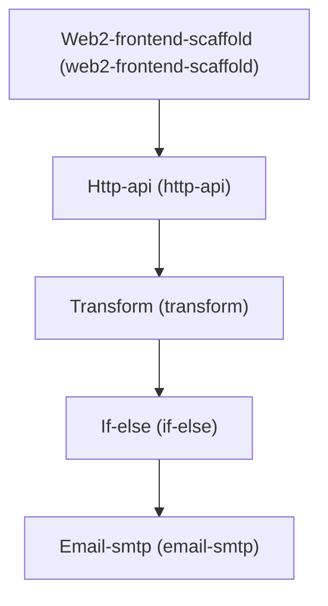

# Architecture

## Dependency Graph

## Execution / Implementation Order

1. **Web2-frontend-scaffold** (`c11d4402`)
2. **Http-api** (`7618fbd0`)
3. **Transform** (`f241c118`)
4. **If-else** (`29273b02`)
5. **Email-smtp** (`145957c1`)
