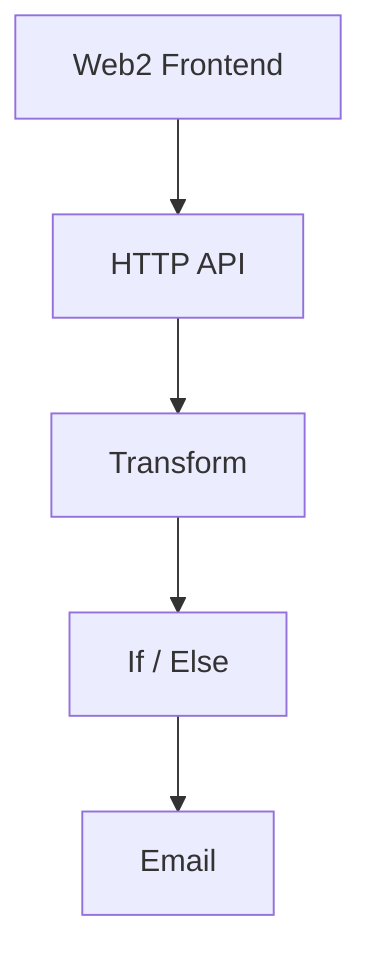

# My App

> A Web2 application composed with [N]skills.

**Network**: Arbitrum Sepolia (Chain ID: 421614) — Testnet
**Keywords**: 

---

## Architecture

## Components

| Component | Type | Category | User Prompt |
|-----------|------|----------|-------------|
| Web2 Frontend | `web2-frontend-scaffold` | app | (none) |
| HTTP API | `http-api` | logic | (none) |
| Transform | `transform` | logic | (none) |
| If / Else | `if-else` | logic | (none) |
| Email | `email-smtp` | logic | (none) |

## Implementation Order

Build the project in this order (respects dependencies):

1. **Web2 Frontend** (`web2-frontend-scaffold`) — see `.nskills/components/web2-frontend-scaffold--c11d4402.md`
2. **HTTP API** (`http-api`) — see `.nskills/components/http-api--7618fbd0.md`
3. **Transform** (`transform`) — see `.nskills/components/transform--f241c118.md`
4. **If / Else** (`if-else`) — see `.nskills/components/if-else--29273b02.md`
5. **Email** (`email-smtp`) — see `.nskills/components/email-smtp--145957c1.md`

## Environment Variables

| Key | Description | Required | Default |
|-----|-------------|----------|---------|
| `RESEND_API_KEY` | Resend API key for sending emails | Yes |  |

## Key Dependencies

| Package | Version |
|---------|---------|
| `next` | `^14.2.0` |
| `react` | `^18.3.0` |
| `react-dom` | `^18.3.0` |
| `@tanstack/react-query` | `^5.50.0` |
| `typescript` | `^5.4.0` |
| `@types/react` | `^18.3.0` |
| `@types/react-dom` | `^18.3.0` |
| `@types/node` | `^20.0.0` |
| `tailwindcss` | `^3.4.0` |
| `postcss` | `^8.4.0` |
| `autoprefixer` | `^10.4.0` |

## Detailed Component Specs

- [Web2 Frontend](.nskills/components/web2-frontend-scaffold--c11d4402.md)
- [HTTP API](.nskills/components/http-api--7618fbd0.md)
- [Transform](.nskills/components/transform--f241c118.md)
- [If / Else](.nskills/components/if-else--29273b02.md)
- [Email](.nskills/components/email-smtp--145957c1.md)

## Additional Context

- [Project Configuration](.nskills/project.md)
- [Full Architecture Details](.nskills/architecture.md)
- [All Environment Variables](.nskills/environment.md)
- [Verified Dependencies](.nskills/dependencies.md)
- [Scripts Reference](.nskills/scripts.md)
- [Integration Map](.nskills/integration-map.md)

---

*Generated by [[N]skills](https://www.nskills.xyz) — Compose N skills for your Web2 project.*
